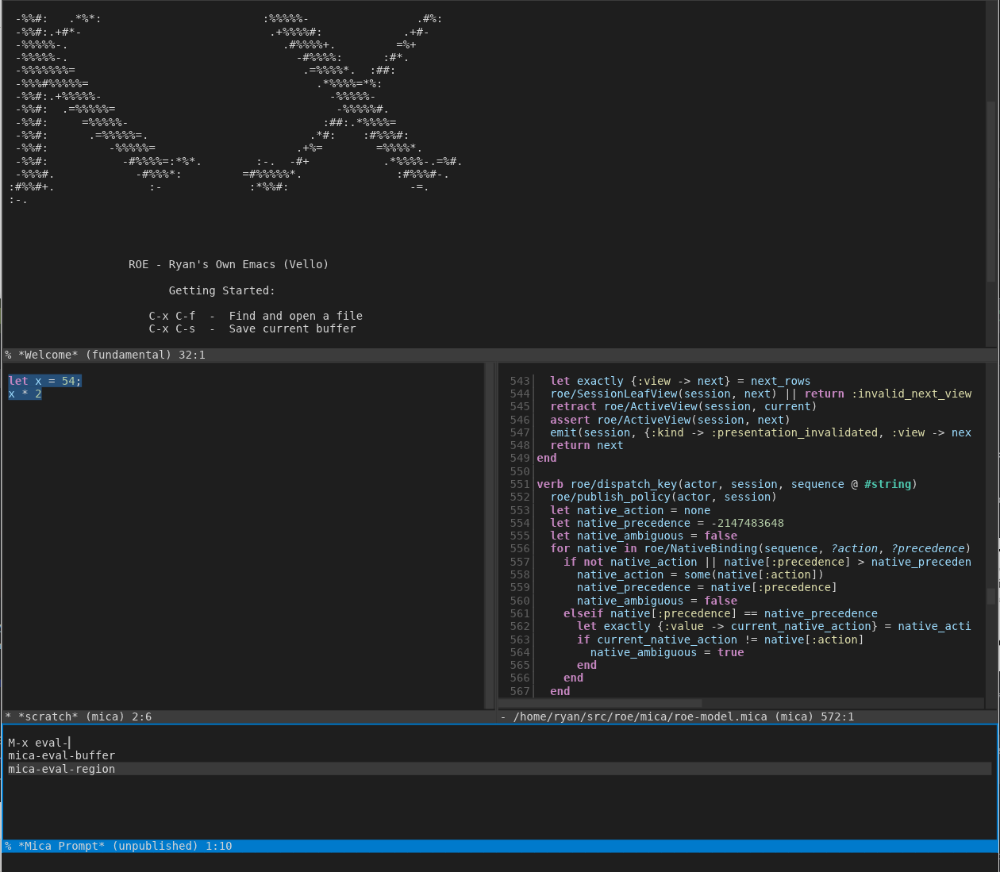
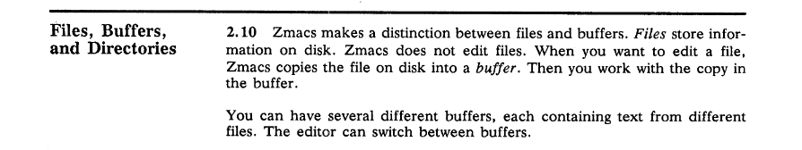

# Roe / ᚱᛟ / Ryan's Own Emacs

Roe is a small, buffer-oriented text editor in the Emacs tradition. It is written in Rust, uses
Emacs-style keys, and delegates editor policy to an embedded
[Mica](https://github.com/timbran-project/mica) live programming environment.



Roe is a direct-manipulation editor rather than a modal one. Buffers are first-class objects;
windows are views into buffers; scratch, prompt, diagnostics, results, messages, and welcome buffers
do not need files behind them.



_From the Zmacs manual. Zmacs was an early Lisp Machine member of the Emacs family, predating GNU
Emacs and sharing the original Emacs tradition in which files and editable buffers are distinct
things._

> Roe is active work, not yet a daily-driver replacement for GNU Emacs. The implemented path is real
> and tested, but the command set and live-environment tooling are still deliberately small.

## What is Mica?

[Mica](https://github.com/timbran-project/mica) is a relational programming language and runtime for
building live, persistent systems. Identities, facts, rules, behavior, and authority inhabit a
queryable world; tasks change that world transactionally, and named source units can be checked and
replaced while it continues running. Native hosts provide bounded access to operating-system and
application mechanisms.

Roe embeds Mica in-process and uses that model for editor behavior and policy. Roe's Mica world is
currently workspace-local and in-memory; durable persistence is planned but is not enabled yet.

In short Mica takes the place that Lisp usually takes in the rest of the Emacs pantheon.

## What works today

- Two frontends over the same editor session:
  - `roe`, an incremental Crossterm terminal frontend;
  - `roe-vello`, a native Vello/WGPU frontend with Parley text layout.
- Rope-backed, character-indexed text editing with Unicode-safe movement and mutation.
- Emacs-style movement, mark/region selection, shift selection, kill ring, undo, and redo.
- Multiple buffers and split views, including buffer creation, switching, guarded killing, and
  logical view selection.
- File open, visit, and save prompts with completion, normalized directory navigation, and `..`.
- Forward and backward incremental search with Mica-defined faces.
- Mouse positioning, selection, view activation, scrolling, and split-border dragging.
- An always-present `*scratch*` Mica buffer plus welcome, messages, prompt, result, and diagnostic
  buffers.
- Mica buffer and region evaluation with recoverable diagnostics.
- Mica syntax highlighting in scratch and `.mica` files. Rust and other language modes are future
  additions.
- Safe Mica experimentation: Roe rejects invalid code and keeps the last working editor behavior.

## Building and running

The repository pins Rust 1.97.1 in `rust-toolchain.toml`; Cargo will select it automatically when
Rustup is installed.

```bash
# Build the whole workspace.
cargo build --release

# Terminal frontend.
./scripts/run.sh [files...]

# Native Vello frontend (requires a graphical environment).
./scripts/run-vello.sh [files...]
```

Both frontends accept zero or more paths. With no path, Roe starts on the welcome buffer while
retaining the distinguished `*scratch*` buffer for live Mica work.

```bash
./scripts/run.sh README.md
./scripts/run-vello.sh mica/roe-first-wave.mica
```

## Key bindings

Roe follows GNU Emacs conventions where they have been implemented. This is not yet the complete GNU
Emacs binding set. Production bindings are Mica policy in `mica/roe-first-wave.mica`; Rust only
normalizes keys and realizes the bounded native action selected by Mica.

### Movement and selection

| Keys                                   | Action                              |
| -------------------------------------- | ----------------------------------- |
| Arrow keys, `C-f`, `C-b`, `C-n`, `C-p` | Move by character or line.          |
| `C-a`, `C-e`, `Home`, `End`            | Move to beginning or end of line.   |
| `M-f`, `M-b`, `C-Right`, `C-Left`      | Move by word.                       |
| `M-{`, `M-}`                           | Move by paragraph.                  |
| `C-v`, `M-v`, `Page Down`, `Page Up`   | Move by page.                       |
| `M-<`, `M->`, `C-Home`, `C-End`        | Move to beginning or end of buffer. |
| `C-Space`                              | Set the mark.                       |
| `C-x h`                                | Mark the whole buffer.              |
| Shift plus movement                    | Extend the selection.               |

### Editing and search

| Keys                                | Action                                                     |
| ----------------------------------- | ---------------------------------------------------------- |
| `Backspace`, `Delete`, `C-d`        | Delete a character.                                        |
| `C-k`                               | Kill to the end of the line.                               |
| `C-w`, `M-w`                        | Kill or copy the active region.                            |
| `M-d`, `M-Backspace`, `C-Backspace` | Kill forward or backward by word.                          |
| `C-y`                               | Yank the newest kill.                                      |
| `C-/`, `C-_`, `C-x u`, `C-7`        | Undo.                                                      |
| `M-/`                               | Redo.                                                      |
| `C-s`, `C-r`                        | Incremental search forward or backward.                    |
| `C-g`, `Esc`                        | Cancel the current prompt, search, or selection operation. |

### Files, buffers, and views

| Keys             | Action                                                            |
| ---------------- | ----------------------------------------------------------------- |
| `C-x C-f`        | Find a file.                                                      |
| `C-x C-v`        | Visit a file in the active view.                                  |
| `C-x C-s`        | Save the active buffer, prompting for a destination when needed.  |
| `C-x b`          | Switch to a buffer; an unmatched name creates an ordinary buffer. |
| `C-x k`          | Kill a buffer, subject to Mica's modified-buffer policy.          |
| `C-x 2`, `C-x 3` | Split the active view horizontally or vertically.                 |
| `C-x o`          | Select the next view.                                             |
| `C-x 0`, `C-x 1` | Delete the active view or all other views.                        |

In a prompt, use `Up`/`C-p` and `Down`/`C-n` to select a candidate, `Enter` to accept it, and `C-g`
or `Esc` to cancel. File candidates ending in `/` are directories; `Enter` descends and `../`
ascends. Typed relative paths resolve against the directory shown in the prompt.

### Commands and Mica

| Keys      | Action                                                                     |
| --------- | -------------------------------------------------------------------------- |
| `M-x`     | Discover and invoke an authorized Mica command.                            |
| `C-c C-b` | Check and atomically file in the active Mica scratch buffer.               |
| `C-c C-r` | Evaluate the selected region as Mica task code.                            |
| `C-l`     | Redraw the frame.                                                          |
| `C-x C-c` | Quit Roe.                                                                  |
| `F12`     | Insert the current Unix time; this is a small shipped Mica/native example. |

## Mica programming model

Mica is not an optional command plugin layered over a Rust editor policy stack. In the production
path it owns editor meaning:

- commands, discovery, arguments, and invocation;
- keymaps, prefixes, binding precedence, and text-action selection;
- prompts, completion, file/buffer selection, and incremental-search state;
- major/minor modes, hooks, faces, syntax rules, highlighting policy, and configuration;
- packages and effective-policy composition; and
- logical active-view and window-target decisions.

Rust owns bounded mechanisms: Rope storage and mutation, file/process/watcher operations,
generation-checked resources, validated layout mutation, session ordering, renderer-neutral
presentation, terminal cells, and Vello/WGPU resources.

The shipped ontology and generic behavior are in [`mica/roe-model.mica`](mica/roe-model.mica). The
default package, commands, bindings, faces, Mica mode, and prompt behavior are in
[`mica/roe-first-wave.mica`](mica/roe-first-wave.mica).

The distinguished scratch buffer is Mica source associated with the volatile `roe/user_scratch`
unit. `C-c C-b` validates the whole buffer before replacing that unit, so malformed source leaves
the previous working unit live. `C-c C-r` evaluates a selected task fragment in the editor endpoint
without replacing the source unit.

Durable user/workspace Mica persistence is not enabled yet. Live changes last for the workspace, and
explicit export/recovery operations are available, but there is not yet a user init-file, schema
migration, backup, or automatic restore policy.

## If Mica code breaks

Roe checks Mica source before installing it, so a bad edit normally leaves the last working version
in place. If an experiment does leave the editor policy unusable, these commands work without
starting the affected policy:

```bash
# Check a file and report errors without installing it.
./scripts/run.sh --mica-check my-policy.mica

# Return to Roe's built-in policy.
./scripts/run.sh --mica-restore-first-wave
```

Run either frontend with `--help` for the lower-level policy inspection, export, replacement, and
package controls used by Roe development.

## Architecture

The production event path is shared by both frontends:

```text
terminal or Vello platform event
  -> renderer-neutral InputEvent
  -> ordered workspace attachment
  -> Mica key, prompt, command, and policy transaction
  -> bounded native action, external request, or effect
  -> Rust text, file, layout, or resource mechanism
  -> revisioned PresentationUpdate plus LifecycleEvent
  -> terminal cells or Vello scene
```

The Cargo workspace contains four crates:

- `roe`: terminal binary and Crossterm event loop;
- `roe-core`: buffers, native mechanisms, Mica bridge, workspace, and session protocol;
- `roe-terminal`: terminal presentation realization;
- `roe-vello`: Winit/Vello GPU frontend and presentation realization.

`WorkspaceHost` owns editor state, buffers, Mica, native resources, file watchers, and processes. An
`Attachment` owns frontend-local viewport/focus, exact input ordering, presentation revision,
pointer/scroll state, and frontend service grants. `SessionClient` is the transport-neutral frontend
contract; `DirectSessionClient` is the current in-process implementation.

## Development and verification

Run the repository check before committing:

```bash
./scripts/check.sh
```

It runs formatting, all-target workspace checks, strict Clippy, the complete test suite, and the
dependency-policy check. Useful focused checks include:

```bash
cargo +1.95.0 check --workspace --all-targets
cargo test -p roe-core mica_ -- --test-threads=1
cargo test -p roe-vello --test session_conformance
cargo test -p roe-vello production_mica_session_builds_a_vello_scene_without_a_display
./scripts/test-phase0-terminal-workflows.sh
./scripts/measure-phase0-baseline.sh
```

Security auditing is separate because it requires `cargo-audit`:

```bash
./scripts/check-security.sh
```

## Current limitations and direction

The next broad phase is growing Roe from a programmable editor into a live environment. Important
missing pieces include:

- first-class inspectors for Mica objects, relations, tasks, packages, and authority;
- durable, recoverable workspace and user-policy state;
- richer source, diagnostic, task, and relation views;
- syntax modes beyond Mica, starting with Rust;
- keyboard macros, query replace, and broader GNU Emacs command coverage;
- LSP integration and other language tooling;
- a remote/separate-process implementation of the existing session protocol; and
- application surfaces beyond text editing.

The headless Vello scene and shared frontend conformance tests run in CI. A real display-host Vello
smoke test remains dependent on the local graphics environment.

## Contributing

Bug reports and focused patches are welcome. Reports are most useful when they include the frontend,
exact keys or pointer actions, relevant lifecycle/error output, and whether the problem reproduces
through both terminal and Vello.

Roe is licensed under GPL-3.0-only; see [`LICENSE`](LICENSE).
