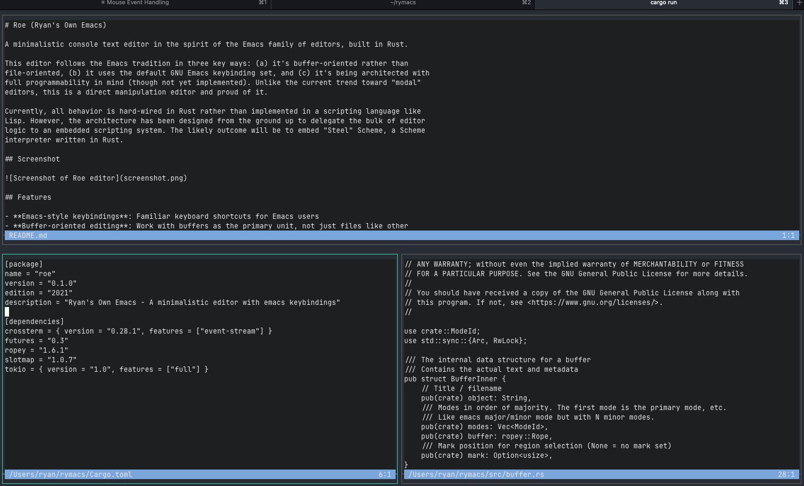

# Roe / ᚱᛟ / Ryan's Own Emacs

A minimalistic console text editor in the spirit of the Emacs family of editors, built in Rust.

This editor follows the Emacs tradition in three key ways: (a) it's buffer-oriented rather than
file-oriented, (b) it uses the default GNU Emacs keybinding set, and (c) it's fully programmable
via an embedded scripting language. Unlike the current trend toward "modal" editors, this is a
direct manipulation editor and proud of it.

Roe uses Julia as its extension language (where Emacs uses Elisp). Keybindings, commands, and
interactive modes can all be defined in Julia. The core editor is implemented in Rust for
performance, while Julia provides the high-level customization layer.

## Screenshot



## Features

- **Emacs-style keybindings**: Familiar keyboard shortcuts for Emacs users, fully customizable
- **Julia scripting**: Define commands, keybindings, and interactive modes in Julia
- **Buffer-oriented editing**: Work with buffers as the primary unit, not just files like other
  editors. Just like GNU emacs.
  - Even the command entry window is a buffer.
- **Window management**: Split windows horizontally/vertically, switch between them, same as emacs.
- **Mouse support**: Click to position cursor, drag window borders to resize, click to switch
  windows
- **Modular architecture**: Extensible mode system for different editing behaviors
- **Terminal-based**: Lightweight, runs in your terminal
- **Fast rendering**: Uses crossterm for efficient terminal manipulation with incremental updates

## Key Bindings

Keybindings are defined in Julia and can be customized in your `.roe.jl` configuration file.
The defaults follow GNU Emacs conventions. Use `define_key("C-x C-s", "save-buffer")` syntax
to add or override bindings.

### Cursor Movement

#### Basic Movement

- Arrow keys or `C-f/b/n/p`: Move right/left/down/up
- `C-a`: Beginning of line
- `C-e`: End of line
- `Home/End`: Beginning/end of line

#### Word Movement

- `M-f` or `C-Right`: Move forward by word
- `M-b` or `C-Left`: Move backward by word

#### Paragraph Movement

- `M-{`: Move backward by paragraph
- `M-}`: Move forward by paragraph

#### Page Movement

- `C-v` or `Page Down`: Page down
- `M-v` or `Page Up`: Page up
- `M-Up`: Page up (alternative)
- `M-Down`: Page down (alternative)

#### Buffer Movement

- `C-Home`: Beginning of buffer
- `C-End`: End of buffer

### Window Management

- `C-x 2`: Split window horizontally
- `C-x 3`: Split window vertically
- `C-x o`: Switch to other window
- `C-x 0`: Delete current window
- `C-x 1`: Delete all other windows

### Buffer Management

- `C-x b`: Switch to another buffer
- `C-x k`: Kill (close) a buffer

### Mouse Operations

- **Click**: Position cursor at click location
- **Click in window**: Switch to clicked window
- **Drag window borders**: Resize windows by dragging their borders
- **Mouse events in modes**: Mouse events are forwarded to modes for future extensibility

### File Operations

- `C-x C-f`: Find file
- `C-x C-s`: Save file

### Editing

- Type to insert text
- `<Backspace>`: Delete character before cursor
- `<Delete>`: Delete character at cursor
- `<Enter>`: Insert newline

### Region Selection & Kill Ring

#### Region Selection

- `C-Space`: Set mark at cursor (start region selection)

#### Kill Ring Operations

- `C-w`: Kill (cut) region between mark and cursor
- `M-w`: Copy region to kill ring without deleting
- `C-k`: Kill (cut) from cursor to end of line
- `C-y`: Yank (paste) most recent kill
- `C-S-y`: Yank from kill-ring index 0

### Command & Control

- `M-x`: Command mode (interactive command execution)
- `C-g`: Cancel current operation (e.g., clear region selection)
- `C-x C-c`: Quit
- `Esc`: Escape

## Building and Running

```bash
# Set up Julia (downloads and configures Julia distribution)
./scripts/setup-julia.sh

# Build the project
cargo build --release

# Run the editor
./scripts/run.sh
```

## Configuration

Roe loads configuration from `~/.roe.jl` on startup. Example configuration:

```julia
using Roe

# Custom keybindings
define_key("C-s", "save-buffer")      # Quick save
define_key("C-q", "quit")             # Quick quit
define_key("F5", "my-build-command")  # Custom command

# Define a custom command
define_command("insert-date", "Insert current date") do ctx
    InsertAction(ctx.cursor_pos, string(Dates.today()))
end
```

See `jl/keybindings.jl` for the full list of default keybindings.

## Architecture

Roe is built with a clean separation of concerns:

- **Buffer**: Text storage using `ropey` for efficient editing
- **Window**: View into a buffer with cursor and scroll position
- **Mode**: Defines behavior and keybindings for different editing contexts
- **Editor**: Coordinates buffers, windows, and modes
- **Frame**: Represents the terminal screen real estate

## Current Status

This is a work-in-progress editor. Currently implemented:

- **Text editing**: Basic insertion, deletion, cursor movement
- **Advanced movement**: Word-wise, paragraph-wise, and page navigation with Emacs key bindings
- **Window management**: Split windows horizontally/vertically, switch between windows
- **Buffer management**: Multiple buffers, switching, killing with interactive selection
- **Region selection**: Mark system with visual highlighting
- **Kill ring**: Cut, copy, paste with kill ring history
- **Command mode**: Interactive command execution (M-x) with completion
- **File operations**: Open and save files with interactive file selector
- **Mouse integration**: Click-to-position cursor, window switching, border dragging for resizing
- **Terminal UI**: Efficient incremental rendering with borders, modelines, and echo area
- **Julia scripting**: Full integration with Julia for customization:
  - Customizable keybindings via `define_key()`
  - User-defined commands via `define_command()`
  - Interactive modes written in Julia (file selector, buffer switcher)
  - FFI access to buffer contents from Julia

## Next steps / not yet implemented

- **Macro system**: Record and playback keystroke sequences
- **Search and replace**: Interactive search, query-replace functionality
- **Syntax highlighting**: TreeSitter integration for language-aware editing
- **LSP integration**: Language server protocol support for modern development features
- **Advanced editing**: Multiple cursors, rectangular selections, etc.
- **Undo/redo**: Currently partially implemented

## Contributing & Feedback

This editor is very much a work-in-progress and almost certainly has bugs. It also probably won't
meet your real editing needs yet. However, feedback and bug reports are very welcome!

If you encounter issues or have suggestions, please file them in the project's issue tracker. Even
if the editor isn't ready for daily use, your input helps guide development priorities and catch
problems early.

**Please report:**

- Crashes or unexpected behavior
- Missing features that are essential for your workflow
- Performance issues
- Ideas for improvements or missing Emacs functionality
